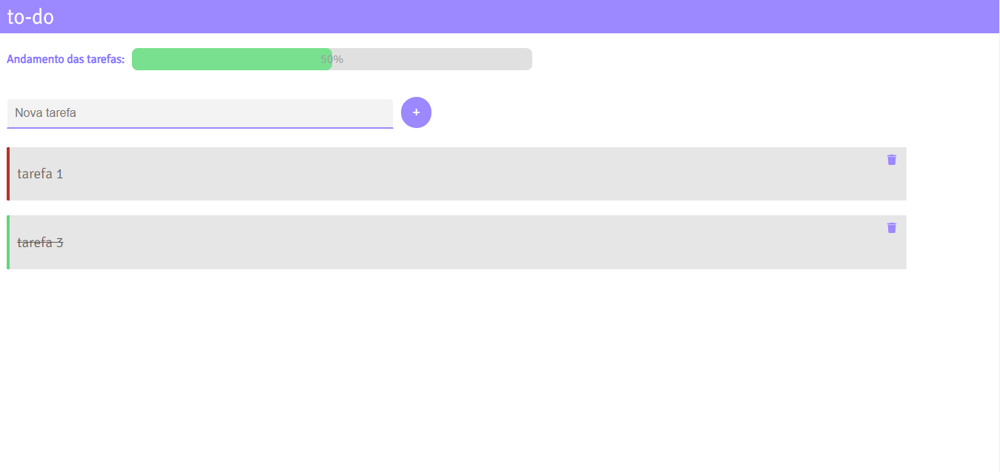

## 📝 TO DO LIST

#### Repositório para o Projeto 02 - Lista de tarefas do curso de VueJS da Cod3r.

---

### :eyes: Para visualizar o projeto
1. Baixe ou clone este repositório
2. Na prompt de comando, no diretório da pasta do projeto, rode o comando <b>npm install</b>
3. Quando a instalação das dependências for concluída, rode o comando <b>npm run serve</b>
4. Abra no navegador o endereço que for apontado após a conclusão do comando anterior

---

### ⚙️ Funcionalidades

- Cadastro de tarefas
- Exibição de lista de tarefas (concluídas e não concluídas)
- Opção de marcar uma tarefa como concluída ou pendente
- Visualização de porcentagem de tarefas concluídas dentro da lista total de tarefas

---

### 🛠 Tecnologias e ferramentas utilizadas
- HTML/CSS
- VueJS
- Google Fonts
- FontAwesome

---

### 🦸 Autora

Bruna Nunes

---

### 📝 Licença

Este projeto esta sobe a licença [MIT](./license.txt).
